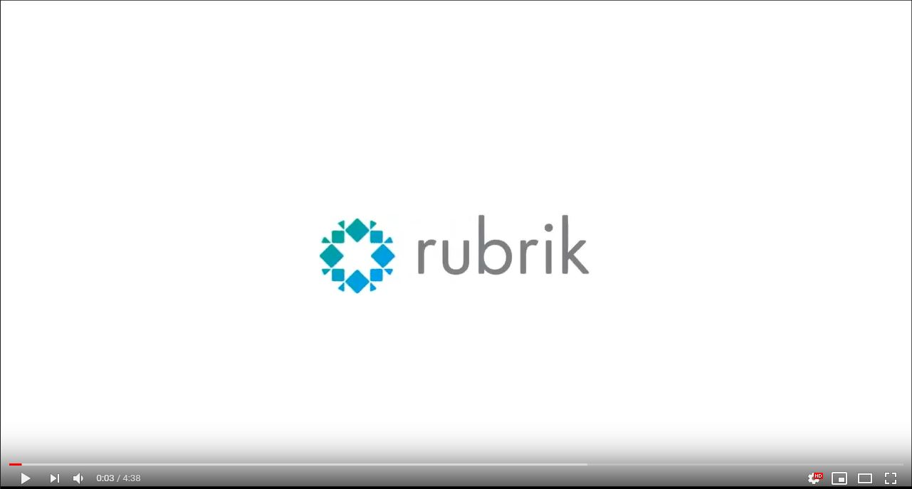

# rbkcli

## Compatibility

**rbkcli** is compatible with any combination of the following:
 - OS: 
	* Linux
	* Mac
	* Windows
	
 - Python:
	* python-2.7.16
	* python-3.5.6
	* python-3.6.9
	* python-3.7.3

## Requirements

Before starting the installation make sure you match the following requirements
 - Python (2.7, 3.5-3.7)
 - pip (Python's package indexer)
 - setuptools (Python module that automates modules installation)
 
In order to install setuptools package you can run the following command:
 
```
$ pip install setuptools
```

For more information on how to install Python for each platform please visit: [Python Software Foundation](https://www.python.org/)

## Tutorials
For windows setup, we have a **rbkcli** "How to" video available:
[](https://youtu.be/OR0EgzBLADc "rbkcli How to install on Windows")

## Installation

Option 1:

1. Install from source, by downloading **rbkcli** with **GitHub** link: https://github.com/rubrikinc/rbkcli.git

```
$ git clone https://github.com/rubrikinc/rbkcli.git
$ cd rbkcli
$ python setup.py install
```


Option 2:
1. Install from Python Package Index, with pip:

```
$ pip install rbkcli
```

Post install:
1. Enable auto-complete (**only for bash environments**):

```
$ echo ' eval "$(register-python-argcomplete rbkcli)"' >> ~/.bashrc
$ . ~/.bashrc
```

## Configuring target

By default, the rbkcli will attempt to read the the Rubrik Cluster credentials from the following environment variables:

* `rubrik_cdm_node_ip`
* `rubrik_cdm_username`
* `rubrik_cdm_password`

You can also specify a token to be used in the authentication by exporting the following environment variable, but it is not required:
* `rubrik_cdm_token`

#### Linux

So for Linux/Mac systems the commands to be run would be:

```
$ export rubrik_cdm_node_ip=<IP>
$ export rubrik_cdm_username=<username>
$ export rubrik_cdm_password=<password>
$ export rubrik_cdm_token=<token>
```

#### Windows

For windows systems the commands to be run would be:

```
$ set rubrik_cdm_node_ip=<IP>
$ set rubrik_cdm_username=<username>
$ set rubrik_cdm_password=<password>
$ set rubrik_cdm_token=<token>
```

The token will take precedence over *username/password* authentication, once the token expires rbkcli will default back to username and password if provided.

## Example
Once the above environment variables are exported, rbkcli will dynamically create the command line based on the available APIs in that cluster.

```
$ rbkcli cluster me
EnvironmentHandler # No cached API found for this target, importing APIs...
{
  "acceptedEulaVersion": "0.0",
  "apiVersion": "1",
  "id": "XXXXXXXX-XXXX-XXXX-XXXX-XXXXXXXXXXXX",
  "latestEulaVersion": "1.1",
  "name": "MyCluster",
  "timezone": {
    "timezone": ""
  },
  "version": "4.2.2-1699"
}
```

At this point all rbkcli features should be available, including auto-complete.

## More information

For more information about **rbkcli** tool and its features go to:
* [About rbkcli](about.md)

For complete **rbkcli** usage and feature documentation go to:
* [Summary](SUMMARY.md)

To discuss any subject related to **rbkcli** got to Rubrik Support Portal Forums:
* [rbkcli Forum](https://support.rubrik.com/s/topic/0TO1W000000AQVdWAO/rbkcli)

To provide any feedback or ask any questions, you can also send and email to **rbkcli@rubrik.com**
